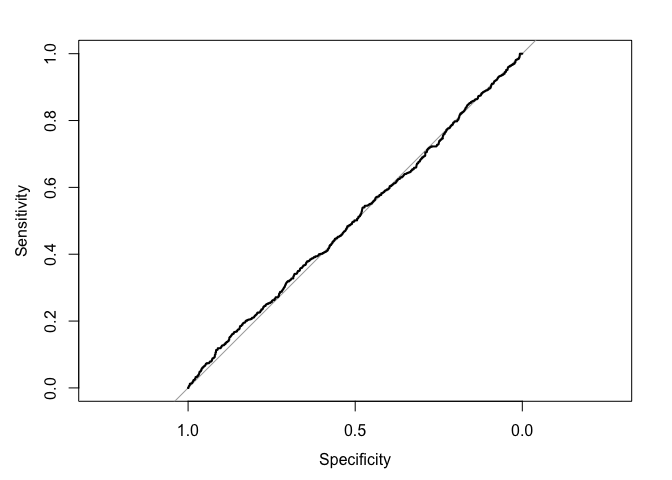
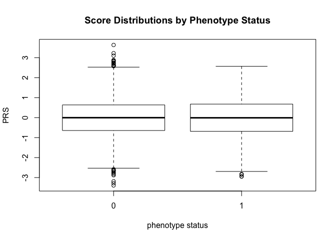

<!-- README.md is generated from README.Rmd. Please edit that file -->

# geneticriskR

<!-- badges: start -->

[](https://travis-ci.org/aballou16/geneticriskR)
<!-- badges: end -->

## Package Aims

The goal of geneticriskR is to provide standard formatting, statistical
analyses and plotting for polygenic risk score data generated using
[PRSice-2](https://www.prsice.info/) software. Because recent genetic
risk studies have shown a great deal of inconsistency, this package will
aid the reproducibility of future studies.

## Installation

You can install the development version of geneticriskR from
[Github](https://github.com/) with:

``` r
# install.packages("devtools")
devtools::install_github("aballou16/geneticriskR")
```

## Inspiration

PRS research has seen significant backlash over the past decade. Much of
this controversy is the result of inconsistent, unreproducible results.
While sharing genetic data is difficult (due to privacy and patient
protection laws), using GeneticriskR will allow for other researchers to
understand and replicate the analyses that formed the study.

## Example(s)

This is a basic example which demonstrates how to run a simple logistic
regression model using an example output file from PRSice-2 called
“test\_data.”

``` r
library(geneticriskR)
simple_mod <- simple_logistic_reg(test_data, "hypertension")
simple_mod
#> 
#> Call:  glm(formula = full_table[[phenotype]] ~ prs, family = "binomial", 
#>     data = full_table)
#> 
#> Coefficients:
#> (Intercept)          prs  
#>    -1.14120      0.05571  
#> 
#> Degrees of Freedom: 3299 Total (i.e. Null);  3298 Residual
#> Null Deviance:       3655 
#> Residual Deviance: 3654  AIC: 3658
```

This is another example which demonstrates how to run roc/auc analysis
on the model generated above.

``` r
proc_analysis(test_data, "hypertension", simple_mod)
#> Setting levels: control = 0, case = 1
#> Setting direction: controls < cases
```



    #> 
    #> Call:
    #> roc.default(response = full_table[[phenotype]], predictor = my_model$fitted.values,     plot = TRUE)
    #> 
    #> Data: my_model$fitted.values in 2500 controls (full_table[[phenotype]] 0) < 800 cases (full_table[[phenotype]] 1).
    #> Area under the curve: 0.5138

This is an example of one of the standard plots included in most PRS
analyses:a side by side box plot comparing scores for cases and conrols.

``` r
compare_boxplots(test_data, "hypertension", "prs")
#> cases = 1, controls = 0
```


